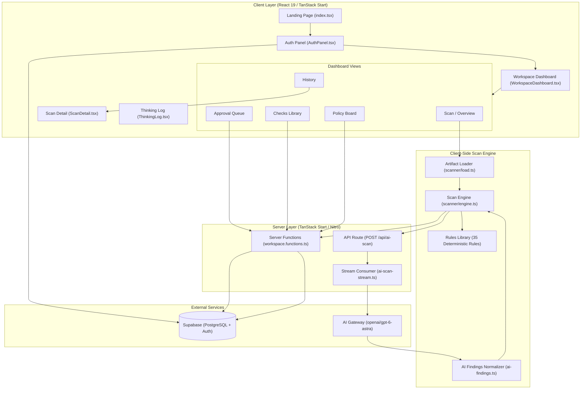

# Lume — See the risk before it runs.

> **Deep security inspection for Claude skills. Know what an AI skill will do before you trust it.**

Lume is a full-stack security platform that scans Claude (Anthropic) skill artifacts for hidden intent, unsafe behavior, data leakage, and supply-chain compromise — before they ever run in your environment. It combines 35 deterministic rule-based checks with a live GPT-powered AI reviewer that reasons through each skill's content in real time, delivering a scored verdict (clean / suspicious / malicious) alongside per-finding remediation guidance and a human-in-the-loop approval workflow.

---

## Key Features

| Feature | Description |
|---|---|
| **35-Rule Deterministic Engine** | Regex-based checks derived from OWASP LLM Top 10, MITRE ATLAS, and NIST AI RMF covering prompt injection, data exfiltration, privilege escalation, supply-chain compromise, bias, and more |
| **Live AI Review (GPT)** | Streams real-time reasoning from a high-effort GPT model that reads the skill top-to-bottom, surfacing multi-step threats the deterministic rules miss |
| **Risk Scoring** | A calibrated 0–100 score with configurable thresholds for "review" and "block" verdicts; supports automatic blocking on any critical finding |
| **Custom Checks Library** | Teams can add their own regex-based detection rules; the AI can suggest new checks automatically by reading skill content |
| **Approval Workflow** | Human-in-the-loop review queue: analysts confirm or dismiss findings; AI containment calls wait for human sign-off before enforcement |
| **Policy Board** | Workspace admins configure score thresholds and preview how policy changes would reclassify existing scans in real time |
| **Scan History & Comparison** | Full audit trail with timestamps, verdict history, risk trend chart, and side-by-side comparison of any two scans |
| **Containment Actions** | Skills can be quarantined (blocked) or cleared; every decision is timestamped and attributed |
| **Workspace & RBAC** | Per-organization workspaces with admin and analyst roles; viewers can observe but cannot modify |
| **ZIP & Multi-File Support** | Upload individual files, multi-file selections, or .zip archives up to 20 MB |

---

## System Architecture

<p align="center"><strong>Figure 1 — Lume System Architecture</strong></p>



### Architecture Flow — Step by Step

1. **Landing Page (`/`)** — A public marketing page presents Lume's value proposition with a product demo video. Navigation links lead to login or the dashboard.

2. **Authentication (`/login`, `/auth/callback`)** — Supabase Auth handles email/password or OAuth sign-in. A server-side callback route exchanges the token and establishes a session.

3. **Workspace Bootstrap** — On first login, users are prompted to name a workspace. The `createWorkspace` server function calls a Supabase RPC (`create_organization_with_admin`) to provision an organization and assign the user the admin role.

4. **Dashboard Load** — The `WorkspaceDashboard` component calls `getWorkspace` which fetches organization membership, risk settings, and the most recent 100 scan records from Supabase.

5. **Skill Upload & Client-Side Scan** — The user uploads `.md`, `.txt`, `.json`, `.yaml`, `.zip`, or script files. The browser-side `readArtifact` function decodes and extracts files (including ZIP archives up to 20 MB).

6. **Deterministic Engine** — `scanArtifact` runs all 35 built-in rules plus any enabled custom checks against every line of every file. Structural checks (e.g., missing author/license) run post-scan. Findings are severity-weighted and scored.

7. **AI Streaming Review** — The client calls `/api/ai-scan` with artifact content and deterministic findings. The server streams GPT reasoning tokens back as Server-Sent Events; the `ThinkingLog` component renders them live.

8. **Findings Merge & Save** — Novel AI findings are merged with deterministic findings, the score is recomputed, and the combined result is saved to Supabase via `saveScan`.

9. **Review Workflow** — Analysts triage findings in the **History** or **Review Queue** tabs, marking them as real risks, false positives, or escalating to the approval queue. Every action re-scores the scan.

10. **Policy Board** — Admins adjust score thresholds using sliders and immediately preview how their existing scans would be reclassified. Changes are persisted via `updateRiskSettings`.

---

## Tech Stack

| Layer | Technology |
|---|---|
| **Framework** | [TanStack Start](https://tanstack.com/start) (React 19, file-based routing) |
| **Runtime** | [Bun](https://bun.sh) |
| **Styling** | [Tailwind CSS v4](https://tailwindcss.com), [Radix UI](https://www.radix-ui.com) primitives, [shadcn/ui](https://ui.shadcn.com) component library |
| **State / Data** | [TanStack Query](https://tanstack.com/query), TanStack Router |
| **AI SDK** | [Vercel AI SDK](https://sdk.vercel.ai) (`ai` package) — `streamText` with SSE streaming |
| **AI Model** | `openai/gpt-6-astra` via Lovable AI Gateway |
| **Auth & Database** | [Supabase](https://supabase.com) (PostgreSQL + Row-Level Security + Auth) |
| **ORM / Migrations** | [Drizzle ORM](https://orm.drizzle.team) + [Drizzle Kit](https://orm.drizzle.team/kit-docs/overview) |
| **Build** | [Vite](https://vitejs.dev) 8 + [@lovable.dev/vite-tanstack-config](https://lovable.dev) |
| **Server Runtime** | [Nitro](https://nitro.build) |
| **Validation** | [Zod](https://zod.dev) |
| **Icons** | [Lucide React](https://lucide.dev) |
| **Toasts** | [Sonner](https://sonner.emilkowal.ski) |
| **Charts** | [Recharts](https://recharts.org) |
| **Linting / Formatting** | [ESLint](https://eslint.org) + [Prettier](https://prettier.io) |
| **Type Safety** | [TypeScript](https://www.typescriptlang.org) 5.x |

---

## Setup Instructions

### Prerequisites

- [Bun](https://bun.sh) >= 1.3 (`npm install -g bun` or `curl -fsSL https://bun.sh/install | bash`)
- A [Supabase](https://supabase.com) project (free tier works)
- A [Lovable](https://lovable.dev) account with an API key (for AI features)
- Node.js 18+ (for tooling compatibility; Bun is the primary runtime)
- Git

---

### 1. Clone the Repository

```bash
git clone https://github.com/ritvikindupuri/Lume---Skill-detection.git
cd Lume---Skill-detection
```

### 2. Install Dependencies

```bash
bun install
```

### 3. Configure Environment Variables

Copy the example and fill in your values:

```bash
cp .env .env.local
```

Open `.env.local` and set:

```env
# Supabase — found in your Supabase project -> Settings -> API
SUPABASE_URL=https://<your-project-ref>.supabase.co
SUPABASE_PUBLISHABLE_KEY=sb_publishable_<your-key>
VITE_SUPABASE_URL=https://<your-project-ref>.supabase.co
VITE_SUPABASE_PUBLISHABLE_KEY=sb_publishable_<your-key>

# Lovable AI — found in your Lovable project settings
LOVABLE_API_KEY=<your-lovable-api-key>
```

> **Note:** `SUPABASE_URL` and `VITE_SUPABASE_URL` should be identical. The `VITE_` prefix exposes the value to the browser bundle; the unprefixed version is used by server functions.

### 4. Set Up the Database

Lume uses Supabase Migrations. Apply all migrations to your Supabase project:

```bash
# Install the Supabase CLI if you haven't already
npx supabase login

# Link to your project
npx supabase link --project-ref <your-project-ref>

# Push all migrations
npx supabase db push
```

Alternatively, run the SQL files in `supabase/migrations/` manually in the Supabase SQL Editor in chronological order.

### 5. Start the Development Server

```bash
bun run dev
```

Open [http://localhost:3000](http://localhost:3000) in your browser.

### 6. Build for Production

```bash
bun run build
```

### 7. Preview the Production Build

```bash
bun run preview
```

---

### Optional: Enable Drizzle Studio (Database Viewer)

If you have `LOVABLE_DB_MIGRATION_URL` set (a direct Postgres connection string from Supabase):

```bash
npx drizzle-kit studio
```

---

## How to Use the App

### Step 1 — Sign In

1. Navigate to the app root (`/`).
2. Click **Sign in** (top-right) or **Dashboard** — both redirect unauthenticated users to `/login`.
3. On the Login page, enter your email and password (or click **Continue with Google**).
4. After authenticating, you will be redirected to `/dashboard`.

---

### Step 2 — Create Your Workspace

On first sign-in, you will see the **"Name your workspace"** screen.

1. Type a workspace name (minimum 2 characters, e.g., `My Security Team`).
2. Press **Enter** or click **Create workspace ->**.
3. Lume provisions the organization and assigns you the **admin** role.

---

### Step 3 — Scan a Skill

1. From the **Overview** tab (default), click **Scan multiple skills** (top-right of the dashboard).
2. A file picker opens. Select one or more files:
   - Supported formats: `.md`, `.txt`, `.json`, `.yaml`, `.yml`, `.zip`, `.py`, `.js`, `.ts`, `.sh`
   - Maximum total size: **20 MB**
   - ZIP archives are extracted automatically
3. Watch the **Live analysis** panel appear below the summary cards:
   - Step 1: "Reading the skill files" — artifact loading
   - Step 2: "Running N deterministic checks" — all 35+ rules execute client-side
   - Step 3: "GPT reviewing intent, combinations and evasion" — live AI streaming begins
   - The **Model reasoning** pane streams the GPT reviewer's reading log in real time
4. When complete, the **Latest batch** grid displays each scanned skill's name, finding count, analysis duration, and **risk score** (0–100) colored by verdict:
   - **clean** — below the review threshold
   - **suspicious** — in the review band, needs human inspection
   - **malicious** — at or above the block threshold, or has a critical finding

---

### Step 4 — Review Scan History

1. Click the **History** tab.
2. Every scan is listed with: name, date/time, finding count, verdict, score, and containment badge.
3. Click any row to open the **Scan Detail** panel below the list.
4. In Scan Detail you will see:
   - **Findings grouped** by status: Needs review / Pending analyst approval / Real risks / False positives
   - Each finding shows: rule ID, title, severity, confidence %, file:line, exact evidence excerpt, and remediation advice
   - The **AI recommendation banner** shows the GPT containment call (quarantine / allow) and its confidence

---

### Step 5 — Triage Findings

For each finding in Scan Detail:

- Click **Real risk** to flag it as a confirmed threat -> the score increases; if severe enough, the skill is quarantined
- Click **False positive** -> a text field opens asking for a reason (minimum 15 characters, kept on record). Click **Dismiss with this reason** -> the finding is removed from the active score
- Analysts may click **Real risk** to escalate to **pending_confirm** status, which sends it to the Approval Queue for an admin to sign off

---

### Step 6 — Approval Queue

1. Click the **Review queue** tab.
2. Two sections appear:
   - **AI containment recommendations** — skills the GPT reviewer recommended quarantining; click **Approve quarantine** to enforce containment or **Reject** to keep the skill available (decision recorded)
   - **Pending findings** — findings escalated by analysts for final approval; click **Approve** to confirm as real risk or **Revert** to send back to open
3. Click **Refresh** to reload the queue at any time.

---

### Step 7 — Manage Custom Checks

1. Click the **Checks** tab.
2. The page has three sections:

   **Check Author (AI-suggested checks):**
   - Click **Upload skills** and select skill files
   - The AI reads them against your existing check library and proposes up to 6 new pattern-based rules
   - Review each suggestion (code, title, severity, category, regex pattern, evidence, and rationale)
   - Click **+ Add check** to save a suggestion, or the **x** icon to dismiss it

   **Your Checks:**
   - Click **+ New check** to manually author a rule
   - Fill in: Code (e.g., `OPS-001`), Title, Severity, Category, Regex Pattern, Why it matters, How to fix it
   - The pattern field validates the regex live — an error message appears if the regex is invalid
   - Toggle the switch to enable/disable a check on future scans; click the trash icon to delete
   
   **Built-in Checks:**
   - All 35 deterministic rules are listed; click any row to expand and see: category, confidence %, rationale, remediation, and the exact regex pattern
   - Use the search box to filter by rule ID, title, or rationale text

---

### Step 8 — Configure Risk Policy

1. Click the **Policy** tab (admin-only to save; all roles can preview).
2. Adjust two sliders:
   - **Review threshold** — raw score above which a skill becomes "suspicious" (default 18; recommended 15–20)
   - **Block threshold** — raw score at or above which a skill is "malicious" (default 55; recommended 50–60)
3. Toggle **Block critical findings** — when on, any single critical-severity finding makes the verdict malicious regardless of score (strongly recommended)
4. The **Live impact** table on the right updates immediately, showing how your current scan history would be reclassified under the new policy (any scan that would change verdict is highlighted with "would change")
5. Click **Save policy** — only workspace admins see this button

---

### Step 9 — Track Risk Over Time

On the **Overview** tab, the **Risk trend** chart plots your last 20 scans chronologically. Each point is colored by verdict (green/amber/red). Hover any point to see the skill name, scan date, score, and verdict in a tooltip.

---

## Technical Documentation

For a deep-dive into every core feature, the scoring model, AI architecture, database schema, and API contracts, see:

[TECHNICAL_DOCS.md](./TECHNICAL_DOCS.md)
