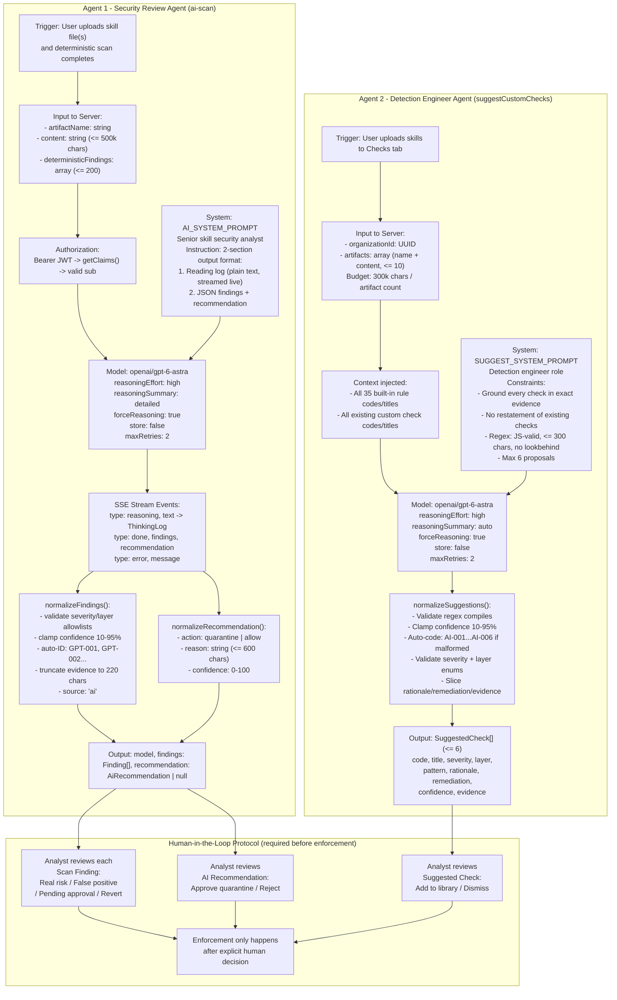

# Lume — Technical Documentation

**By:** Ritvik Indupuri  
**Date:** September 12, 2026

---

## Table of Contents

1. [Executive Summary](#1-executive-summary)
2. [System Architecture](#2-system-architecture)
3. [Agent Architecture](#3-agent-architecture)
4. [Core Features](#4-core-features)
   - 4.1 [Authentication — Email/Password & Google OAuth](#41-authentication--emailpassword--google-oauth)
   - 4.2 [Workspace Provisioning & RBAC](#42-workspace-provisioning--rbac)
   - 4.3 [Artifact Loading & File Ingestion](#43-artifact-loading--file-ingestion)
   - 4.4 [Deterministic Scan Engine](#44-deterministic-scan-engine)
   - 4.5 [35-Rule Detection Library (Full Catalog)](#45-35-rule-detection-library-full-catalog)
   - 4.6 [Confidence Scoring System](#46-confidence-scoring-system)
   - 4.7 [Risk Scoring Model (Full Algorithm)](#47-risk-scoring-model-full-algorithm)
   - 4.8 [Score Explainer UI](#48-score-explainer-ui)
   - 4.9 [AI Security Review Agent (GPT — Real-time Streaming)](#49-ai-security-review-agent-gpt--real-time-streaming)
   - 4.10 [Live Analysis Thinking Log](#410-live-analysis-thinking-log)
   - 4.11 [AI Check Suggestion Agent](#411-ai-check-suggestion-agent)
   - 4.12 [Custom Checks Library](#412-custom-checks-library)
   - 4.13 [Scan Persistence & Audit Trail](#413-scan-persistence--audit-trail)
   - 4.14 [Scan History — Multi-Select, Comparison & Bulk Delete](#414-scan-history--multi-select-comparison--bulk-delete)
   - 4.15 [Human-in-the-Loop Finding Review & Re-scoring](#415-human-in-the-loop-finding-review--re-scoring)
   - 4.16 [Approval Queue](#416-approval-queue)
   - 4.17 [Risk Policy Configuration & Live Impact Preview](#417-risk-policy-configuration--live-impact-preview)
   - 4.18 [Risk Trend Chart](#418-risk-trend-chart)
   - 4.19 [Containment System](#419-containment-system)
   - 4.20 [Markdown Report Export](#420-markdown-report-export)
   - 4.21 [Server-Side Error Handling & h3 Recovery](#421-server-side-error-handling--h3-recovery)
   - 4.22 [AI Gateway Integration (Lovable)](#422-ai-gateway-integration-lovable)
   - 4.23 [Context-Aware Tooltip System](#423-context-aware-tooltip-system)
5. [Database Schema (Full)](#5-database-schema-full)
6. [API Reference](#6-api-reference)
7. [Security Architecture](#7-security-architecture)
8. [Conclusion](#8-conclusion)

---

## 1. Executive Summary

Lume is a full-stack security intelligence platform purpose-built to detect malicious intent, unsafe behaviors, and policy violations in Claude (Anthropic) skill artifacts before those skills are deployed into an AI environment. As organizations increasingly rely on third-party and internally authored skills to extend their AI agents' capabilities, the attack surface for prompt injection, data exfiltration, supply-chain compromise, and unauthorized agency grows correspondingly.

Lume addresses this gap with a two-layer inspection pipeline: a deterministic rule engine — 35 checks derived from OWASP LLM Top 10, MITRE ATLAS, and NIST AI RMF — that runs fully in the browser for speed and privacy, followed by a high-effort GPT model (`openai/gpt-6-astra`) that streams its analysis live as a reading log, surfacing semantic and multi-step threats that pattern matching alone cannot catch. The combined result is a 0–100 risk score, a three-tier verdict (clean / suspicious / malicious), per-finding remediation guidance, a live AI reasoning stream, a human-in-the-loop approval and review workflow, configurable per-organization risk policies, a custom check library with AI-assisted authoring, exportable Markdown reports, a full audit trail, and scan comparison and risk trend visualization.

The platform is built on TanStack Start (React 19, file-based SSR routing), backed by Supabase (PostgreSQL with Row-Level Security and enum-typed organization roles), and served via Vite 8 and Nitro. Authentication supports both email/password and Google OAuth. The AI layer uses the Vercel AI SDK (`streamText`) against a Lovable AI Gateway (OpenAI-compatible endpoint).

---

## 2. System Architecture


<p align="center"><strong>Figure 1 — Lume System Architecture</strong></p>

### Architecture Flow — Step by Step (Aligned with Architecture Diagram)

1. **Security Analysts / Workspace Users (Box 1):**
   - **Upload & Interaction:** Analysts and workspace members access Lume to upload Claude skill files (`.md`, `.txt`, `.json`, `.yaml`, `.yml`, `.zip`, `.py`, `.js`, `.ts`, `.sh`) for scanning.
   - **Triage & Review:** Review detected findings across 8 security layers, inspect full evidence snippets and remediation advice, and view scan comparison audits.
   - **Containment Oversight:** Approve or reject AI-recommended containment actions and manually quarantine or clear skills.
   - **Policy & Detection Engineering:** Configure workspace risk thresholds (`acceptableScore`, `maliciousScore`, `blockOnCritical`), create custom regex checks, and test AI-suggested detection rules.

2. **Lume Web Application (Box 2):**
   - **Framework & Routing:** Single-page React 19 application built with TanStack Start, TanStack Router (file-based routing), and Tailwind CSS v4.
   - **Dashboard Surface:** Hosts the primary workspace dashboard across five dedicated tabs (Overview, History, Approval Queue, Checks Library, Policy Board).
   - **Scan Orchestration:** Executes the client-side scan pipeline within the browser, streams live AI reasoning chunks into the UI, and communicates with authenticated server functions.
   - **Triage State Machine:** Provides interactive interfaces (`ScanDetail.tsx`, `ApprovalQueue.tsx`) for marking real risks, recording written false-positive justifications, and triggering instant re-scoring.

3. **Lume Scan Pipeline (Box 3 — 5-Stage Multi-Engine Inspection):**
   - **Stage 1 (Artifact Loader — `scanner/load.ts`):** Ingests uploaded files or extracts `.zip` archives up to 20 MB via `JSZip`, performs binary classification and UTF-8 decoding, parses `SKILL.md` YAML frontmatter, and extracts external endpoint URLs. Outputs normalized `ArtifactFile[]`.
   - **Stage 2 (Deterministic Rules Engine — `scanner/engine.ts`):** Evaluates all non-binary files line-by-line against 35 built-in rules (`RULES`) plus active workspace custom regex checks (`compiledChecks`). Applies noise capping (max 5 findings per rule per file) and executes structural checks (ATT-027). Computes deterministic SHA-256 fingerprint. Outputs initial findings list, category counts, and baseline score.
   - **Stage 3 (Live AI Review — `ai-scan-stream.ts`):** Sends artifact content (up to 500k chars) and pre-computed deterministic findings to `/api/ai-scan`. Streams real-time model reasoning tokens to `ThinkingLog.tsx` while analyzing multi-step prompt injection, data exfiltration, supply-chain backdoors, and logic evasion. Outputs structured AI findings and containment recommendation.
   - **Stage 4 (Findings Merge & Risk Scoring — `mergeAiFindings()`):** Deduplicates AI findings against deterministic findings (`file:line:evidence.toLowerCase()`), applies the mathematical severity weighting model with diminishing returns damping (`1 / (1 + 0.55 * n)`), maps the raw score (0–100) across policy thresholds, and assigns the verdict (`clean`, `suspicious`, `malicious`). Outputs final `ScanResult`.
   - **Stage 5 (Review Decisions, Approvals & Containment):** Analysts triage findings. When findings are dismissed or confirmed, `reviewFinding` dynamically recalculates active severity counts, re-runs `computeScore()`, and updates the scan's containment status (`quarantined`, `cleared`, `none`).

4. **Authenticated Server Functions (Box 4 — `workspace.functions.ts`):**
   - **Typed RPC Layer:** 14 server functions created using TanStack Start's `createServerFn` executing in the Nitro server context.
   - **Middleware Security:** Protected by `requireSupabaseAuth` middleware which validates Bearer JWTs, decodes user claims via `getClaims()`, and injects authenticated Supabase clients into the execution context.
   - **Data Access:** Handles workspace creation/retrieval, scan and finding persistence, finding status updates, containment decisions, custom check CRUD, and AI check generation.

5. **AI Review Route — Server-Side (Box 5 — `api/ai-scan.ts`):**
   - **Authenticated Streaming Route:** Validates incoming Bearer JWTs and parses payloads with strict Zod schemas.
   - **AI Analysis Service Integration:** Instantiates the Lovable AI Gateway client (`openai/gpt-6-astra` with `reasoningEffort: "high"`) using `createLumeAi()`.
   - **Real-Time SSE Streaming:** Streams text deltas as Server-Sent Events (`{ type: "reasoning", text }`) to the client, parses the final JSON block, normalizes findings and containment recommendations, and emits the completion event (`{ type: "done", findings, recommendation }`).

6. **Primary Data Store (Box 6 — Supabase PostgreSQL + Auth):**
   - **Authentication:** Handles email/password and Google OAuth sessions, issuing cryptographically signed JWTs.
   - **Relational Schema:** Stores `organizations`, `organization_members` (with enum roles: `admin`, `analyst`, `viewer`), `risk_settings`, `skill_scans`, `scan_findings`, and `custom_checks`.
   - **Row-Level Security (RLS):** Database-level security policies ensure workspace data is strictly isolated to authenticated organization members.

7. **Outputs & Visibility (Box 7):**
   - **Overview:** Summary metric cards (total scans, average risk, blocked count), latest batch results, and risk-over-time trend.
   - **Thinking Log:** Real-time visual progress steps and auto-scrolling model reasoning stream.
   - **Scan Detail:** Grouped finding triage views (Needs review, Pending approval, Real risks, False positives) with evidence snippets, confidence scores, and remediation instructions.
   - **History:** Searchable audit log of all analyzed skills with multi-select, bulk deletion, and side-by-side 10-field comparison grid.
   - **Approval Queue:** Centralized dual-queue managing pending AI containment calls and escalated analyst findings awaiting senior sign-off.
   - **Policy Board:** Real-time interactive sliders for review and block thresholds with live-impact reclassification simulations.
   - **Checks Library:** Custom regex check authoring, AI check generation from sample skills, and searchable catalog of all 35 built-in rules.

---

## 3. Agent Architecture

Lume embeds two distinct AI agents, each with a dedicated role, system prompt, model configuration, and normalized output contract.

<p align="center"><strong>Figure 2 — Lume Agent Architecture</strong></p>



### Agent 1 — Security Review Agent

**Files:** `src/routes/api/ai-scan.ts`, `src/lib/ai-findings.ts`, `src/lib/ai-scan-stream.ts`

**Role:** Acts as a senior AI skill security analyst. It receives the full artifact content and the list of already-detected deterministic findings, then performs a deep semantic review to surface threats that pattern matching cannot catch:
- Multi-step prompt injection chains where individual instructions appear harmless in isolation
- Hidden conditional triggers and dormant backdoors (date/time/keyword activated)
- Covert data exfiltration (DNS beacons, rendered image URL parameters)
- Unsafe agency patterns (unapproved code execution, human-approval bypass)
- Supply-chain compromise (obfuscated payloads, self-modifying skill content)
- Cross-context contamination, hallucination inducement, discrimination, and bias

**Model Configuration:**
```
model: openai/gpt-6-astra
reasoningEffort: "high"
reasoningSummary: "detailed"
forceReasoning: true
store: false
include: ["reasoning.encrypted_content"]
maxRetries: 2
```

**Two-Section Output Format:**
1. **Reading Log (Section 1, streamed live):** Plain prose, one line per thing read, format: `[file:line] "short exact excerpt" → analysis`. Each line describes what the model saw and whether it raised concern. This section ends with a one-line overall judgment.
2. **JSON Findings Block (Section 2, emitted on completion):** Enclosed in a ` ```json ``` ` fence. Contains a `recommendation` (quarantine/allow, reason, confidence) and a `findings` array.

**Key Safety Constraints in System Prompt:** `"Never invent a finding. Report only behavior supported by an exact excerpt. Do not duplicate the supplied deterministic findings."`

**Human Oversight:** The AI's `"quarantine"` recommendation is stored with `recommendation_status: "pending"`. It is **never automatically enforced**. A human analyst must approve or reject it in the Approval Queue or the Scan Detail panel before any containment change takes effect.

---

### Agent 2 — Detection Engineer Agent

**Files:** `src/lib/check-suggestions.ts`, `src/lib/workspace.functions.ts` (`suggestCustomChecks`)

**Role:** Acts as a detection engineer. Given skill artifact content and the full list of existing check codes/titles (both 35 built-in rules and all custom checks for the organization), it proposes new deterministic regex-based detection rules grounded in actual patterns found in the uploaded artifacts.

**System Prompt Constraints:**
- Every proposal must be grounded in an exact excerpt from the supplied artifacts
- Must not restate any existing check
- Patterns must be valid JavaScript regexes (no lookbehind, no backreferences, max 300 chars)
- Maximum 6 new checks per invocation
- If no gaps exist, return an empty list

**Output Normalization (`normalizeSuggestions`):**
- Validates pattern with `new RegExp(pattern, "i")`
- Rejects patterns with lookbehind (`(?<`) or backreferences (`\1`)
- Clamps confidence to 10–95%
- Falls back to `AI-001`, `AI-002`, etc. if the AI-proposed code is malformed
- Slices rationale and remediation to 500 chars each, evidence to 220 chars

**Human Oversight:** Suggestions are presented as cards in the Checks tab. Each card shows the code, title, severity, category, regex pattern, evidence excerpt, and rationale. The analyst accepts each individually (persisted to `custom_checks`) or dismisses it (removed from UI).

---

## 4. Core Features

### 4.1 Authentication — Email/Password & Google OAuth

**Files:** `src/components/auth/AuthPanel.tsx`, `src/routes/login.tsx`, `src/routes/auth.callback.tsx`, `src/integrations/supabase/client.ts`, `src/integrations/lovable/index.ts`

The `AuthPanel` component supports two authentication methods:

**Email/Password:**
- Toggle between **Sign in** and **Create account** modes via a bottom link
- Uses `supabase.auth.signInWithPassword({ email, password })` for sign-in
- Uses `supabase.auth.signUp({ email, password, options: { emailRedirectTo: .../dashboard } })` for registration
- On successful sign-up without an immediate session, the user is instructed to check their email for a confirmation link
- Password minimum length: 8 characters (enforced by the `minLength` HTML attribute)
- `autoComplete` attributes are set correctly per mode (`current-password` / `new-password`)

**Google OAuth:**
- Uses `lovable.auth.signInWithOAuth("google", { redirect_uri: .../auth/callback })` from the `@lovable.dev/cloud-auth-js` integration
- If the provider redirects, the auth callback route (`/auth/callback`) handles the token exchange and redirects to `/dashboard`
- If already resolved (e.g., pop-up flow), navigates directly to `/dashboard`

**Session Protection:**
- `WorkspaceDashboard` calls `supabase.auth.getSession()` on mount; unauthenticated users are immediately redirected to `/login`
- Sign-out calls `supabase.auth.signOut()` and navigates to the landing page (`/`)

**Error Display:** Auth errors from Supabase are shown inline below the form as a bordered card with muted text.

---

### 4.2 Workspace Provisioning & RBAC

**Files:** `src/lib/workspace.functions.ts` (`createWorkspace`, `getWorkspace`)

On first login, if the user has no organization membership, the dashboard shows a workspace setup screen. The user enters a name (minimum 2 chars) and Lume:

1. Derives a URL-safe slug: lowercase, non-alphanumeric chars replaced with `-`, stripped of leading/trailing dashes, truncated to 48 chars, then suffixed with an 8-char UUID fragment for uniqueness
2. Calls the Supabase RPC `create_organization_with_admin(_name, _slug)` — a database function that atomically creates the organization record and an `organization_members` row with `role: "admin"` for the calling user

**Roles (`organization_role` enum):**

| Role | Scan | Review Findings | Manage Custom Checks | Approve Queue | Change Policy |
|---|---|---|---|---|---|
| `admin` | ✅ | ✅ | ✅ | ✅ | ✅ (save) |
| `analyst` | ✅ | ✅ | ✅ | ✅ | ✅ (preview only) |
| `viewer` | ✅ (read-only) | ❌ | ❌ | ❌ | ✅ (preview only) |

The `canEdit` UI flag is `role === "admin" || role === "analyst"`. The `canSave` flag (for policy) is `role === "admin"`. Server functions enforce authorization at the database level via Supabase Row-Level Security in addition to the middleware token validation.

> **Roadmap:** Teammate invitations (invite code or email-based join) are planned but not yet implemented.

---

### 4.3 Artifact Loading & File Ingestion

**File:** `src/lib/scanner/load.ts`

`readArtifact(files: File[])` is the entry point for all scan uploads. It produces `{ name: string, files: ArtifactFile[] }`.

**ZIP expansion:** `.zip` files are detected by filename and expanded with `JSZip.loadAsync`. Directories are filtered out. Each entry is decoded individually. A running byte counter prevents the uncompressed content from exceeding 20 MB.

**Binary detection (two-stage):**
1. Extension allowlist check: files ending in `.exe`, `.dll`, `.so`, `.dylib`, `.bin`, `.jar`, `.pyc`, `.wasm`, `.scpt`, `.app`, `.msi`, `.deb`, `.rpm`, `.png`, `.jpg`, `.jpeg`, `.gif`, `.webp`, `.ico`, `.pdf`, `.zip`, `.gz`, `.tar`, `.mp4`, `.mp3`, `.woff2?`, `.ttf`, `.otf` → stored as `{ text: null }`
2. Null-byte sampling: the first 4096 bytes of any non-excluded file are scanned for a null byte (`b === 0`) → `{ text: null }` if found

Binary files are counted in `files_count` and their sizes contribute to `totalBytes` but they are excluded from all rule matching and AI review.

**Encoding:** All text files are decoded with `new TextDecoder("utf-8", { fatal: false })` to handle partial or mixed encodings gracefully.

**Artifact naming:**
- Single file upload → artifact name is the filename
- Multiple files → the common root path prefix (first segment of `webkitRelativePath`, or `"N files"` if paths differ)
- `webkitRelativePath` is used when available (folder uploads via file picker)

**Error conditions:**
- `"No files were provided."` — empty `FileList`
- `"Artifact exceeds the 20 MB limit."` — total size before or after ZIP extraction
- `"No readable text files found in this artifact."` — all files decoded as binary
- `"filename contains no files."` — ZIP archive is empty

---

### 4.4 Deterministic Scan Engine

**File:** `src/lib/scanner/engine.ts` — `scanArtifact()`

The engine is a pure async function that accepts `artifactName`, `files: ArtifactFile[]`, `riskConfig`, and `customRules: CompiledCustomRule[]`. It returns a fully typed `ScanResult`.

**Scan Orchestration (`scanFiles` in `WorkspaceDashboard`):**

The scan button triggers a hidden `<input type="file" multiple accept=".md,.txt,.json,.yaml,.yml,.zip,.py,.js,.ts,.sh">`. For each `File` in the `FileList`, the pipeline executes sequentially:

1. **Step label set:** `"Reading the skill files"` (spinner)
2. **`readArtifact([file])`** — loads and decodes the single file (or extracts ZIP)
3. **Step updated:** `"Read N file(s): path1, path2"` (done) + `"Running N deterministic checks"` (spinner), where N = `RULES.length + compiledChecks.length` (i.e., 35 + enabled custom checks)
4. **`scanArtifact()`** — deterministic engine evaluates all files against rules
5. **Step updated:** `"Deterministic checks complete · M finding(s)"` (done) + `"GPT reviewing intent, combinations and evasion"` (spinner)
6. **Content slice:** All text files joined as `"--- FILE: path ---\ncontent"` and sliced to 500,000 chars for the AI call
7. **`streamAiScan()`** — AI streams; each reasoning chunk appends to `thinking.reasoning` state, rendered live in `ThinkingLog`
8. **Step updated:** `"GPT review complete · K additional finding(s)"` (done)
9. **`mergeAiFindings()`** — combines deterministic + novel AI findings, re-scores
10. **`saveScan()`** — persists result and findings to Supabase
11. Loop repeats for the next file

After all files complete: `setQueue(completed)` populates the **Latest batch** grid on the Overview tab. `refresh()` reloads the workspace metrics and history. A toast/message displays `"N skills analyzed and saved."`

The `"Scan multiple skills"` button displays a `LoaderCircle` spinner and the label `"Analyzing…"` while scanning. The file input `value` is reset to `""` after every batch so the same file can be re-selected immediately.

**Internal Execution Steps of `scanArtifact()`:**

1. **Skill file identification:** Finds the primary skill file by preference: first file matching `/(^|\/)SKILL\.md$/i`, then any `.md` file. Parses its YAML frontmatter via `parseFrontmatter()` for metadata (`name`, `description`, `author`, `license`, `tools` / `allowed-tools`).
2. **Host extraction:** Uses `extractHosts()` to regex-scan every text file for `https?://hostname` references, aggregating unique hosts and counting occurrences into the `endpoints` list.
3. **Line-by-line rule matching:** Iterates every line of every text file. For each non-empty line:
   - Skips if the rule has a `pathPattern` that doesn't match the current file path
   - Skips if this rule has already reached `MAX_FINDINGS_PER_RULE_FILE` (5) findings in this file (noise prevention)
   - Tests the line against the rule's `pattern` (RegExp with `i` flag)
   - On match: records a finding with file path, 1-indexed line number, clipped evidence (≤ 220 chars via `clip()`), source (`"rule"` or `"custom"`), and confidence percentage
   - Active rules = `LINE_RULES` (all 34 line-based rules) + `customRules`
4. **Structural check (ATT-027):** After line scanning, checks whether the identified skill file has both `author` and `license` declared in frontmatter. If **both are absent** (neither `author` nor `license` present), a finding is added with evidence `"no author or license declared"` (source: `"rule"`, confidence: 92%). The check is skipped entirely if no skill file was identified in the artifact.
5. **SHA-256 computation:** Encodes each file as `"path:text"` (or `"path:<binary:N>"` for binary files), joins all parts with a null character `\u0000`, encodes as UTF-8, and calls `crypto.subtle.digest("SHA-256", ...)`. The hex digest is returned from the exported `sha256Hex()` helper.
6. **Scoring:** Calls `computeScore(counts, riskConfig)` with the per-severity counts from all findings.
7. **Result assembly:** Returns the complete `ScanResult` with timing (`durationMs`), file list (path, size, binary flag, finding count), total bytes, rules evaluated count, sorted findings, score breakdown, endpoints, and extracted metadata.

**Finding deduplication in `mergeAiFindings`:** Builds a `Set` of existing finding keys as `"file:line:evidence.toLowerCase()"`. AI findings whose key already exists in this set are discarded as duplicates; novel findings are merged in. The combined list is re-sorted and re-scored.

---

### 4.5 35-Rule Detection Library (Full Catalog)

**File:** `src/lib/scanner/rules.ts`

All rules are declared using the `r()` helper which produces typed `Rule` objects. The `RULES` export is the complete ordered list; `LINE_RULES` excludes structural rules (ATT-027); `RULES_BY_ID` is a lookup map.

**Complete Rule Catalog:**

| ID | Layer | Sev | Title |
|---|---|---|---|
| ATT-001 | Prompt integrity | Critical | Hidden instruction directive |
| ATT-002 | Prompt integrity | Critical | System or operator instruction override |
| ATT-003 | Prompt integrity | Critical | Delegated remote instruction loading |
| ATT-004 | Prompt integrity | High | Instruction payload disguised as an example |
| ATT-005 | Prompt integrity | High | Dormant conditional trigger |
| ATT-006 | Prompt integrity | High | Cross-skill instruction tampering |
| ATT-007 | Agency & tools | Critical | Unscoped command execution |
| ATT-008 | Agency & tools | Critical | Destructive operation |
| ATT-009 | Agency & tools | High | Autonomous network egress |
| ATT-010 | Agency & tools | Critical | Privilege escalation |
| ATT-011 | Resilience | Medium | Unbounded loop or recursive invocation |
| ATT-012 | Agency & tools | Critical | Human approval bypass |
| ATT-013 | Agency & tools | High | Cross-boundary file access |
| ATT-014 | Data leakage | Critical | Covert exfiltration channel |
| ATT-015 | Data leakage | Critical | Credential or secret harvesting |
| ATT-016 | Data leakage | High | Conversation or context telemetry |
| ATT-017 | Privacy | High | Cross-session data reuse |
| ATT-018 | Data leakage | Medium | Broad sensitive file discovery |
| ATT-019 | Privacy | High | Excessive personal or health data collection |
| ATT-020 | Privacy | Medium | Personal data processing without retention limits |
| ATT-021 | Privacy | High | Re-identification of anonymized data |
| ATT-022 | Privacy | High | Third-party personal data sharing without consent |
| ATT-023 | Supply chain | Critical | Unpinned remote dependency |
| ATT-024 | Supply chain | High | Lookalike package reference |
| ATT-025 | Supply chain | Critical | Self-modifying skill or agent configuration |
| ATT-026 | Supply chain | Critical | Obfuscated payload decoding |
| ATT-027 | Supply chain | Medium | Unverifiable artifact provenance _(structural)_ |
| ATT-028 | Supply chain | High | Time-bomb or dormant backdoor |
| ATT-029 | Output integrity | Medium | Unsourced authoritative claims |
| ATT-030 | Output integrity | High | High-stakes advice without verification |
| ATT-031 | Output integrity | Medium | Fabricated tool or source instruction |
| ATT-032 | Bias & fairness | Medium | Demographic stereotype in output guidance |
| ATT-033 | Bias & fairness | High | Protected-attribute decision rule |
| ATT-034 | Resilience | Medium | Unbounded context amplification |
| ATT-035 | Prompt integrity | Critical | Guardrail-bypass framing |

**Layer Distribution:**
- Prompt integrity: 7 rules (ATT-001–006, ATT-035)
- Agency & tools: 6 rules (ATT-007–010, ATT-012–013)
- Data leakage: 4 rules (ATT-014–016, ATT-018)
- Privacy: 5 rules (ATT-017, ATT-019–022)
- Supply chain: 6 rules (ATT-023–028)
- Output integrity: 3 rules (ATT-029–031)
- Bias & fairness: 2 rules (ATT-032–033)
- Resilience: 2 rules (ATT-011, ATT-034)

**Regulatory Basis:** Rules are derived from OWASP Top 10 for LLM Applications, MITRE ATLAS adversarial ML threat matrix, and the NIST AI Risk Management Framework Generative AI Profile.

---

### 4.6 Confidence Scoring System

**File:** `src/lib/scanner/rules.ts` — `ruleConfidence()`, `confidenceLabel()`, `ConfidenceHint.tsx`

Confidence answers "how sure are we this match is what the check is looking for?" — it is distinct from severity, which answers "how bad is it?"

**Base confidence by severity:**

| Severity | Base Confidence |
|---|---|
| `critical` | 88% |
| `high` | 78% |
| `medium` | 68% |
| `low` | 58% |

**Confidence overrides** (rules whose patterns are intentionally broad or narrow):

| Rule | Override | Reason |
|---|---|---|
| ATT-004 | 62% | "copy exactly / follow these instructions" in examples — can be legitimate |
| ATT-005 | 60% | Conditional triggers span many innocent patterns |
| ATT-013 | 45% | Path traversal regex catches many legitimate usages |
| ATT-015 | 55% | Credential file names appear in documentation too |
| ATT-018 | 55% | Broad file discovery commands are common in dev scripts |
| ATT-020 | 48% | Personal data retention language is very broad |
| ATT-023 | 60% | Package install commands are common in setup scripts |
| ATT-026 | 58% | Long base64 strings appear in legitimate config |
| ATT-027 | 92% | Structural check — missing author/license is unambiguous |
| ATT-029 | 60% | "Always state X without sources" can be legitimate |
| ATT-031 | 62% | "Fabricate citation" may appear in negative examples |
| ATT-032 | 50% | Demographic language is very broad |
| ATT-034 | 52% | "Read all files" is common in legitimate tools |

**Confidence labels** (shown in UI):
- ≥ 80%: **High precision** — specific signals, low false positive rate
- 60–79%: **Moderate precision** — worth reviewing but needs context
- < 60%: **Broad heuristic** — elevated false positive risk, closer human review advised

**Custom checks:** Use the confidence value set by the analyst at creation time (default 60%).

**AI findings:** Use the model's own calibrated estimate, clamped to 10–95%.

---

### 4.7 Risk Scoring Model (Full Algorithm)

**File:** `src/lib/scanner/engine.ts` — `computeScore()`, `normalizePolicy()`

The scoring model is fully deterministic and reproducible. It operates in five stages:

**Input normalization (`normalizePolicy`):**
```
acceptableScore = clamp(1, 98, policy.acceptableScore)
maliciousScore  = max(acceptableScore + 1, clamp(1, 100, policy.maliciousScore))
```

**Stage 1 — Severity contribution with diminishing returns:**
For each severity level (critical, high, medium, low), in that order:
```
contribution = Σ(i=0 to count-1)  weight(severity) / (1 + 0.55 × i)
```
This means a second critical finding contributes `40 / 1.55 ≈ 25.8` rather than 40, a third `40 / 2.10 ≈ 19.0`, and so on. This prevents a single rule type from dominating the score when it fires multiple times.

**Severity weights:**

| Severity | Weight |
|---|---|
| `critical` | 40 |
| `high` | 18 |
| `medium` | 7 |
| `low` | 2 |

**Stage 2 — Raw score (inherent score):**
```
rawScore = min(100, round(Σ contributions across all severities))
```

**Stage 3 — Threshold-relative mapped score:**
```
if rawScore ≤ acceptableScore:
    score = round( (rawScore / acceptableScore) × 17 )           → 0–17 (clean band)
elif rawScore < maliciousScore:
    score = round( 18 + ((rawScore - acceptable) / (malicious - acceptable)) × 36 )   → 18–54 (review band)
else:
    score = round( 55 + ((rawScore - malicious) / max(1, 100 - malicious)) × 45 )    → 55–100 (block band)
```
This normalization ensures that a score of 18 always means "just at the review boundary" regardless of the organization's specific threshold settings. Threshold changes visually shift where scans fall on the scale.

**Stage 4 — Verdict:**
```
if (blockOnCritical AND counts.critical > 0) OR rawScore ≥ maliciousScore:
    verdict = "malicious"
elif rawScore ≥ acceptableScore:
    verdict = "suspicious"
else:
    verdict = "clean"
```

**Stage 5 — Score breakdown:**
The function also returns `steps: ScoreStep[]` — per-severity `{ count, weight, contribution }` tuples — used by the ScoreExplainer UI component.

**Default policy:** `acceptableScore: 18`, `maliciousScore: 55`, `blockOnCritical: true`

---

### 4.8 Score Explainer UI

**File:** `src/components/dashboard/ScoreExplainer.tsx`

A self-contained panel rendered in the Scan Detail view that explains the scoring algorithm to reviewers in plain language. It shows:

1. **The severity weight table** — rendered from the live `SEVERITY_WEIGHT` constants (critical 40, high 18, medium 7, low 2)
2. **Diminishing returns explanation** — "The second match of a severity is worth 65% of the first, the third about 48%, and so on"
3. **Raw score cap** — "The total is capped at 100 — this is the inherent score"
4. **Threshold mapping** — dynamically interpolated from the workspace's current `policy.acceptableScore` and `policy.maliciousScore` values
5. **Verdict rule** — whether `blockOnCritical` is active

When called with optional `breakdown`, `rawScore`, and `score` props, it also renders a per-scan **Score Breakdown** table showing:
- `N × severity @ weight → +contribution` for each severity level
- `inherent (capped): rawScore`
- `after your thresholds: finalScore/100`

This breakdown is generated by the engine's `computeScore` and passed through the scan result.

---

### 4.9 AI Security Review Agent (GPT — Real-time Streaming)

**Files:** `src/routes/api/ai-scan.ts`, `src/lib/ai-findings.ts`, `src/lib/ai-scan-stream.ts`

#### Server Handler (`/api/ai-scan`)

The POST handler performs in sequence:

1. **Authorization:** Validates the `Authorization: Bearer <jwt>` header; decodes via `supabase.auth.getClaims(token)`. Returns `401` immediately if invalid.
2. **Input parsing:** Validates request body with the `bodySchema` Zod schema:
   - `artifactName`: string, 1–255 chars
   - `content`: string, 1–500,000 chars
   - `deterministicFindings`: array (≤200) of `{ruleId, title, severity, file, line, evidence}`
3. **AI provider creation:** `createLumeAi(lovableApiKey)` constructs an `@ai-sdk/openai` instance pointing to `https://ai.gateway.lovable.dev/v1` with `Lovable-API-Key` and `X-Lovable-AIG-SDK` headers.
4. **Streaming:** Calls `streamText` with `AI_MODEL`, the system prompt, and the user prompt built by `aiUserPrompt(artifactName, deterministicFindings, content)`. Binds `abortSignal: request.signal` so cancellation propagates.
5. **Reading log extraction:** As text deltas arrive, the output string is split at the first ` ``` ` fence. Everything before the fence is the reviewer-facing reading log. New characters beyond the last-streamed position are emitted as `{ type: "reasoning", text }` SSE events in real time.
6. **Completion:** On stream end, `extractJson(output)` parses the JSON block from the fenced section. `normalizeFindings` and `normalizeRecommendation` validate and clean the data. A `{ type: "done", model, findings, recommendation }` event is emitted.
7. **Error handling:** HTTP errors 402 (out of credits), 403 (blocked), 429 (rate limited), and 401 (misconfigured) produce specific user-facing messages in the `{ type: "error", message }` event.
8. **Response headers:** `Content-Type: text/event-stream`, `Cache-Control: no-cache, no-transform`, `Connection: keep-alive`

#### Client SSE Consumer (`ai-scan-stream.ts`)

`streamAiScan(payload, onReasoning)`:
1. Retrieves the current Supabase session access token; throws `"Your session expired"` if missing
2. `fetch`es `/api/ai-scan` with `Content-Type: application/json` and `Authorization: Bearer <token>`
3. Reads the `ReadableStream` body chunk by chunk using a `TextDecoder` with `{ stream: true }` for chunked UTF-8
4. Splits each decoded chunk on `\n\n` (SSE event delimiter), finds lines starting with `"data: "`, and JSON-parses the event payload
5. Calls `onReasoning(text)` for reasoning events (updating `ThinkingLog` state)
6. Stores the `done` event result; throws with the error message on `error` events
7. After the stream closes: throws if no result was received (`"AI review ended before returning a verdict"`)

---

### 4.10 Live Analysis Thinking Log

**File:** `src/components/dashboard/ThinkingLog.tsx`

The `ThinkingLog` component renders a real-time progress panel during scanning. It has three parts:

**Step list (ordered):**  
Each step is a `{ label: string; done: boolean }`. Steps progress through:
1. `"Reading the skill files"` (loading) → `"Read N file(s): path1, path2"` (done)
2. `"Running N deterministic checks"` → `"Deterministic checks complete · M finding(s)"` (done)
3. `"GPT reviewing intent, combinations and evasion"` → `"GPT review complete · K additional finding(s)"` (done)

A spinning loader icon (`LoaderCircle`) marks in-progress steps; a checkmark (`Check`) marks completed ones.

**Reasoning pane:**  
A scrollable `max-h-64` mono-font `div` that streams the AI reading log character by character via `onReasoning` callbacks. A `useEffect` auto-scrolls to the bottom as new text arrives. An animated cursor pulse is shown while `active` is true.

**Header:**  
Shows a `Brain` icon, the section label "Live analysis", and the current artifact filename (truncated). A spinning `LoaderCircle` is shown in the header while `active`.

---

### 4.11 AI Check Suggestion Agent

**Files:** `src/lib/check-suggestions.ts`, `src/lib/workspace.functions.ts` (`suggestCustomChecks`)

The `suggestCustomChecks` server function is triggered when an analyst uploads skills in the Checks tab. It:

1. Loads the organization's existing custom checks (code + title) from Supabase
2. Imports and accesses all 35 built-in rule titles via the `RULES` export
3. Calculates per-artifact budget: `floor(300,000 / artifactCount)` characters each
4. Constructs the `suggestUserPrompt(knownChecks, artifacts)` string which injects the full existing check inventory followed by each artifact's content
5. Calls `streamText` on `SUGGEST_MODEL` (`openai/gpt-6-astra`) with `reasoningEffort: "high"`, `reasoningSummary: "auto"`, `forceReasoning: true`
6. Awaits the full response text (not streamed to the client — the complete result is returned synchronously)
7. Calls `extractJson(text)` then `normalizeSuggestions(parsed)` to produce validated `SuggestedCheck[]`

The UI presents each suggestion in an expandable card with: `code · title` header, severity/layer/confidence% metadata line, the full regex pattern in mono font, any evidence excerpt from the artifact, and the rationale. Analysts click **+ Add check** to accept (calls `createCustomCheck`) or the **×** to dismiss.

---

### 4.12 Custom Checks Library

**Files:** `src/components/dashboard/ChecksLibrary.tsx`, `src/lib/workspace.functions.ts`

The Checks tab has three distinct sections:

**Section 1 — Check Author (AI-suggested):**
The Checks tab's top panel. Admins/analysts upload skills; the AI suggestion agent runs and results appear as dismissible cards. Each card shows the proposed code, title, severity, layer, confidence %, regex pattern, evidence excerpt, and rationale. Individual suggestions can be accepted (added to `custom_checks`) or dismissed. The AI's suggestion note (e.g., "3 suggestions from 2 skills") is shown at the top.

**Section 2 — Your Checks (manual):**
Lists all custom checks for the organization. The **+ New check** button expands an inline form with:
- **Code:** 3–20 chars, letters/numbers/dashes (stored uppercase); unique per org (DB constraint)
- **Title:** 3–120 chars
- **Severity:** select: critical / high / medium / low
- **Category:** select: one of 8 layer values
- **Pattern:** regex string; validated live with `new RegExp(pattern, "i")` — an inline error message is shown immediately for invalid patterns; the Save button is disabled until the pattern is valid
- **Why it matters (rationale):** textarea, ≤ 500 chars
- **How to fix it (remediation):** textarea, ≤ 500 chars

Each saved check row shows: code · title, the regex in mono font (`/pattern/i`), severity + layer + confidence%. An **enable/disable switch** toggles the check without deletion; a **trash icon** permanently deletes it.

**Section 3 — Built-in Checks:**
A searchable list of all 35 built-in rules with a live-filtering search box. Clicking any rule expands an accordion-style detail panel showing: category, confidence % + label, rationale, remediation, and the exact regex pattern. For structural checks (ATT-027, whose pattern is a placeholder character), a note explains that it inspects declared metadata rather than matching text.

---

### 4.13 Scan Persistence & Audit Trail

**File:** `src/lib/workspace.functions.ts` (`saveScan`, `getScanFindings`, `deleteScan`)

Every completed scan is persisted immediately after the AI review via `saveScan`. This function:

1. Reads the organization's `block_on_critical` policy setting
2. If `blockOnCritical` is true and `counts.critical > 0`, sets `containment: "quarantined"` and `contained_at` immediately (auto-block)
3. Sets `recommendation_status: "pending"` if the AI recommended quarantine but auto-blocking did not apply
4. Inserts one row into `skill_scans` and (if findings exist) up to 300 rows into `scan_findings` in a second INSERT call
5. Returns the new scan UUID

**Scan record includes:** artifact name, declared name (from frontmatter), SHA-256, score, verdict, finding count, file count, rules evaluated count, severity counts (JSONB), scan timestamp, containment state, AI recommendation action/reason/confidence, recommendation status.

**Finding record includes:** rule ID, title, severity, category (layer label), file path, line number, evidence, remediation, confidence, and initial `status: "open"`.

The `skill_scans` list is fetched most-recent-first with a limit of 100 records per workspace load.

---

### 4.14 Scan History — Multi-Select, Comparison & Bulk Delete

**File:** `src/components/dashboard/ScanHistory.tsx`

The History tab renders the complete scan audit trail with rich interaction:

**Row display:** Each scan row shows a checkbox (for selection), the skill name (declared or artifact), scan timestamp, finding count, file count, verdict badge (color-coded), risk score (mono font), and a delete button. Inline status chips appear for:
- `Bot icon + "Awaiting your approval"` — when the AI recommended quarantine and no human has decided yet
- `ShieldBan + "Auto-blocked · critical"` — policy auto-block due to critical finding
- `"Quarantined"` — manual quarantine by analyst
- `"Cleared"` — manually cleared for deployment

**Multi-select:** Checkboxes allow selecting any number of scans. When items are selected, a toolbar appears above the list:
- **Compare** button — enabled only when exactly 2 scans are selected
- **Delete all** button (admin/analyst only) — deletes all selected scans serially, with a window.confirm dialog listing the count
- **Clear** — deselects all

**Side-by-side comparison panel:** When exactly 2 scans are selected and Compare is clicked, a structured grid appears above the list showing:
- Row-by-row comparison: Skill name, Scanned timestamp, Verdict, Findings count (with color-coded delta), Critical count (delta), High count (delta), Medium count, Files count, Containment, AI call
- Risk Score row rendered in large monospace type (verdict-colored) with a `Delta` badge showing the numeric difference (green = improved, red = worsened)

**Per-scan delete:** Individual delete buttons show a window.confirm dialog with the skill name before proceeding.

**Audit integrity:** Deleting a scan cascades to its `scan_findings` rows (foreign key constraint), ensuring the findings history is consistent.

---

### 4.15 Human-in-the-Loop Finding Review & Re-scoring

**Files:** `src/components/dashboard/ScanDetail.tsx`, `src/lib/workspace.functions.ts` (`reviewFinding`)

`ScanDetail` is the primary triage interface, appearing when a scan row is clicked in the History tab.

**Finding groups (4 tabs-within-panel):**
1. **Needs review** — `status: "open"` — newly flagged, requires analyst attention
2. **Pending analyst approval** — `status: "pending_confirm"` — escalated by a reviewer, waiting for senior sign-off
3. **Real risks** — `status: "confirmed"` — confirmed as genuine threats, counted in score
4. **False positives** — `status: "false_positive"` — dismissed; shown dimmed (`opacity-55`), excluded from score

**Each finding card shows:**
- Rule ID (mono), title, severity, confidence % + label, and a `ConfidenceHint` tooltip button
- File path and line number (mono)
- Evidence box labeled "Found in the skill — not advice" (prevents confusion between evidence and AI-generated advice)
- "What to do" remediation text
- For `pending_confirm`: hourglass icon + "Waiting for an analyst to approve" message
- For `false_positive`: the stored `review_note` if present

**Review action buttons (admin/analyst only):**
- **Real risk:** Transitions `open` → `pending_confirm` (escalates for approval) or toggles `confirmed` ↔ `open`
- **False positive:** Opens an inline textarea requiring a reason (minimum 15 characters; enforced by disabled Save button with character count display). On submit: `status: "false_positive"` + `review_note` stored
- **Revert:** `pending_confirm` → `open`

**Post-review re-scoring (`reviewFinding` server function):**
After every status change:
1. Updates `scan_findings.status` + `reviewed_by` + `reviewed_at` + `review_note`
2. Re-fetches all findings for the scan
3. Filters to `active` (all except false_positive)
4. Recomputes `counts` per severity from active findings
5. Calls `computeScore(counts, workspace policy)` to get new `score` and `verdict`
6. Determines new `containment`:
   - `"quarantined"` if: auto-blocked (critical + blockOnCritical) **OR** any finding is `confirmed` with severity `critical` or `high`
   - `"cleared"` if: all findings are dismissed (active.length === 0) **OR** verdict is `"clean"`
   - `"none"` otherwise
7. Updates `skill_scans.score`, `verdict`, `containment`, `contained_at`, `contained_by`

**Toast notifications** provide immediate feedback: "Skill blocked — not safe to deploy", "Skill cleared for deployment", "Sent for analyst approval", "Decision saved and the skill re-scored" — each with a detail line showing the new score and verdict.

**Auto-block banner:** When `blockOnCritical` is on and the scan has critical findings, a red `ShieldBan` banner at the top of the Scan Detail reads "Auto-blocked by policy" with the count of critical findings. Action buttons are hidden since "the only way to change it is to dismiss the critical findings as false positives with a written reason."

---

### 4.16 Approval Queue

**Files:** `src/components/dashboard/ApprovalQueue.tsx`, `src/lib/workspace.functions.ts` (`listPendingApprovals`, `decideRecommendation`)

The Review Queue tab presents two categories of items requiring human sign-off:

**AI Containment Recommendations:**
Skills where the GPT agent returned `action: "quarantine"` and no human has yet decided. Each card shows:
- Skill name (declared or artifact), score, verdict, scan timestamp
- `"Awaiting approval"` amber chip with hourglass icon
- A secondary panel labeled "Analysis log" showing `ai_recommendation_reason` (the AI's full rationale for recommending quarantine) + confidence %

Action buttons (admin/analyst only):
- **Approve quarantine** (destructive/red) → `decideRecommendation({ scanId, decision: "approve" })` → sets `containment: "quarantined"`, `recommendation_status: "approved"`, `recommendation_decided_by`, `recommendation_decided_at`
- **Reject** (outline) → same function with `decision: "reject"` → `recommendation_status: "rejected"`, `containment: "none"` — skill stays available, decision recorded permanently

**Pending Findings:**
Findings escalated to `status: "pending_confirm"` by analysts. Each card shows:
- Rule ID + category header, finding title
- Skill name + `file:line` reference
- Severity (colored), confidence % + label + `ConfidenceHint` tooltip
- Evidence excerpt, remediation guidance
- If available: AI reading of this specific finding from `ai_recommendation_reason`

Action buttons (admin/analyst only):
- **Approve** → `reviewFinding({ findingId, scanId, status: "confirmed" })` → triggers re-score; if severe enough, quarantines the skill
- **Revert** → `reviewFinding({ status: "open" })` → sends finding back to the open/unreviewed state

**Queue management:** A **Refresh** button at the top reloads from the database. When the queue is empty, a green `CheckCircle2` icon and "The approval queue is clear" message is shown. Viewer-role users see the queue but no action buttons; a note reads "Viewers can see the queue but cannot approve or revert."

---

### 4.17 Risk Policy Configuration & Live Impact Preview

**Files:** `src/components/dashboard/PolicyBoard.tsx`, `src/lib/workspace.functions.ts` (`updateRiskSettings`)

The Policy tab provides workspace-level risk configuration with live feedback.

**Three configurable parameters (via `PolicyControls` sub-component):**

Each parameter label has a `PolicyHint` tooltip (ℹ icon) with detailed guidance:

**Review threshold (`acceptableScore`)** [Slider: 0–98, default 18]:
- Above this raw score a skill becomes "suspicious" — needs human review
- Recommended 15–20. Lowering to 8–14 catches more (better for regulated data). Raising to 25–35 lets more through as clean (only for trusted authors).
- Constrained: always < `maliciousScore` (automatically adjusted on slider change)

**Block threshold (`maliciousScore`)** [Slider: 1–100, default 55]:
- At or above this raw score the verdict becomes "malicious" — not fit to deploy
- Recommended 50–60. Keep ≥ 25 points above the review threshold to maintain a meaningful review band.
- Constrained: always > `acceptableScore`

**Block critical findings** [Toggle, default on]:
- When on: a single critical match is "malicious" regardless of score
- Strongly recommended on (covers credential theft, RCE, exfiltration patterns)
- Turn off only if your team triages every scan manually and prefers score-only judgement

**Live Impact Preview (right panel — `PolicyBoard` main body):**
Three metric tiles show the current `acceptableScore`, `maliciousScore`, and the review band width (`malicious - acceptable` in points).

Below these tiles, the **"Your scans under these thresholds"** table re-classifies the most recent 25 scans in real time. As sliders move, `computeScore(toCounts(scan.severity_counts), policy)` is called client-side for every scan in the preview. Each row shows the skill name, original verdict, new verdict under proposed policy, and score. If a scan would change verdict, a `"would change"` pill appears on that row.

The summary line reads: `"N clean · M to review · K blocked [· P would change]"`

Saving: the **Save policy** button (admin-only, `canSave: role === "admin"`) calls `updateRiskSettings` and shows "Risk policy saved. New scans will use these thresholds." on success.

---

### 4.18 Risk Trend Chart

**File:** `src/components/dashboard/WorkspaceDashboard.tsx` — `Trend` component

The `Trend` SVG chart is rendered in the Overview tab's "Scores over time" section. It visualizes up to the last 20 scans (oldest-to-newest, most-recent 20 of the 100 loaded).

**Implementation:**
- Pure SVG `polyline` using a `viewBox="0 0 100 100"` with `preserveAspectRatio="none"` to fill the container
- Grid lines at y = 0, 25, 50, 75, 100 (solid at boundaries, dashed in between)
- Each data point is an invisible `<button>` absolutely positioned at `(index / (n-1)) × 100%` horizontally and `(100 - score)%` vertically, with a colored inner `<span>` circle
- Point colors: `#22c55e` (clean), `#f59e0b` (suspicious), `#ef4444` (malicious)
- Hover/focus: the circle scales to 1.6× via CSS transform; a `pointer-events-none` tooltip div appears showing: artifact name (truncated), scan date, score (large mono font), verdict badge (pill with 10% opacity background)
- Tooltip positioning: clamped horizontally to 12–88% to prevent edge clipping; flipped above the point if the point is in the top 30% of the chart
- Y-axis: left-aligned tick labels at 0, 25, 50, 75, 100
- X-axis: date of first and last scan in the visible window, plus a legend (green/amber/red dots with labels)
- If fewer than 2 scans exist: shows "Scan two or more skills to see risk over time."

**Accessibility:** Each data point button has `aria-label` with the skill name, score, and verdict. The chart wrapper has `aria-label="Risk score trend"`.

---

### 4.19 Containment System

Containment is the enforcement state of a scanned skill. It is stored in `skill_scans.containment` and re-evaluated on every review action.

**States:**

| State | Meaning | How Set | DB Fields |
|---|---|---|---|
| `none` | No containment — default | Initial state on save | `contained_at: null`, `contained_by: null` |
| `quarantined` | Blocked — not safe to deploy | Auto (critical + blockOnCritical) / analyst confirms severe finding / analyst approves AI recommendation | `contained_at: timestamp`, `contained_by: userId` |
| `cleared` | Explicitly approved for deployment | All findings dismissed as false positives / verdict becomes "clean" after re-scoring | `contained_at: timestamp`, `contained_by: userId` |

**Auto-quarantine on save:** When `saveScan` runs and `block_on_critical` is true and `counts.critical > 0`, the scan is immediately saved with `containment: "quarantined"` — no human approval needed. The Scan Detail shows an "Auto-blocked by policy" banner with no action buttons.

**Re-evaluation after finding review:** `reviewFinding` recalculates containment using logic that accounts for: auto-block conditions, whether any `confirmed` finding has severity critical or high, whether all findings are dismissed, and whether the re-computed verdict is "clean".

**UI indicators:**
- Scan Detail: colored banners — red `ShieldBan` (quarantined / auto-blocked), green `ShieldCheck` (cleared)
- History list: inline chips — red "Auto-blocked · critical", red "Quarantined", green "Cleared"
- Approval Queue: amber "Awaiting approval" chip for pending AI recommendations

---

### 4.20 Markdown Report Export

**File:** `src/lib/scanner/report.ts`

The `toMarkdown(result: ScanResult)` function generates a structured Markdown security report from any `ScanResult` object. The report includes:

- **Header:** "Lume skill security report"
- **Scan metadata:** artifact name, SHA-256, scan timestamp + duration, rules evaluated count, AI review summary (model name + additional finding count, or "not run"), verdict + policy-adjusted score, inherent score + threshold values, per-severity finding counts
- **Declared metadata section** (if present): name, description, author, license, tool list
- **Files analyzed:** per-file path, size in bytes, binary flag, finding count
- **External endpoints section** (if any): each unique host + occurrence count
- **Findings section:** each finding rendered as an H3 with `[SEVERITY] ruleId — title`, then bulleted detail lines: Layer, Detected by (AI intent review / workspace check / built-in check) + confidence %, Location (file:line), Evidence (code-fenced), Why it matters, Remediation

`download(filename, contents, type)` is a utility that creates a `Blob`, generates an object URL, creates a hidden `<a>` element, simulates a click, and revokes the URL — enabling client-side file downloads without a server round-trip.

---

### 4.21 Server-Side Error Handling & h3 Recovery

**Files:** `src/lib/error-capture.ts`, `src/server.ts`

**Problem:** Nitro uses the `h3` framework internally. When an unhandled exception occurs inside a TanStack Start SSR handler, h3 catches it and returns a generic `{ "unhandled": true, "message": "HTTPError" }` JSON response with status 500, discarding the original error and its stack trace.

**Solution — `error-capture.ts`:**
- Wraps `console.error` globally: any `Error` object passed to `console.error` is expanded to a full string (with stack trace and cause chain up to 5 levels deep via `describeError`) before serialization, and is also stored in `lastCapturedError` with a 5-second TTL
- Registers `window.addEventListener("error", ...)` and `window.addEventListener("unhandledrejection", ...)` to capture unhandled promise rejections and uncaught errors

**Solution — `server.ts`:**
- The Nitro server entry wraps every request in a try/catch
- After receiving a response, `normalizeCatastrophicSsrResponse` checks: if status ≥ 500, content-type is JSON, and the body matches `{ "unhandled": true, "message": "HTTPError" }` → calls `consumeLastCapturedError()` (retrieves the original error within its 5s TTL), logs it via `console.error`, and returns a proper HTML error page instead of the raw JSON body
- This ensures that production error logs contain actionable stack traces rather than the h3-swallowed generic message

---

### 4.22 AI Gateway Integration (Lovable)

**File:** `src/lib/ai-gateway.server.ts`

`createLumeAi(lovableApiKey: string)` constructs an OpenAI-compatible SDK provider using `createOpenAI` from `@ai-sdk/openai`:

```ts
createOpenAI({
  baseURL: "https://ai.gateway.lovable.dev/v1",
  apiKey: "gateway-managed",               // not used for auth; key is in header
  headers: {
    "Lovable-API-Key": lovableApiKey,       // project-level auth
    "X-Lovable-AIG-SDK": "vercel-ai-sdk",  // telemetry tag
  },
})
```

This factory is called once per AI request (both scan and suggestion), ensuring each request carries fresh credentials. The `apiKey: "gateway-managed"` placeholder is required by the SDK interface but is not used for authentication — the actual auth is the `Lovable-API-Key` header.

Both agents use the same model (`openai/gpt-6-astra`) and the same gateway, but with different system prompts, provider options, and response handling.

---

### 4.23 Context-Aware Tooltip System

**Files:** `src/components/dashboard/ConfidenceHint.tsx`, `src/components/dashboard/PolicyHint.tsx`

Two specialized tooltip components provide inline contextual help throughout the dashboard:

**`ConfidenceHint`** — An ℹ icon button that opens a Radix UI `Tooltip` explaining the confidence system:
- Distinguishes confidence (precision/false positive rate) from severity (impact)
- Explains base starting values by severity: critical 88%, high 78%, medium 68%, low 58%
- Notes that broad-pattern checks are lowered from these starting values
- Explains that custom checks use the analyst's chosen value, and AI findings use the model's own estimate (clamped 10–95%)
- Threshold guide: 80%+ high precision, 60–79% moderate, <60% broad heuristic

**`PolicyHint`** — A generic configurable tooltip used for each of the three policy controls. Accepts `label` (aria-label), `title` (tooltip heading), and `children` (any ReactNode for the tooltip body). Used in `PolicyBoard` with detailed per-control guidance including recommended ranges and trade-offs.

Both components use Radix UI `TooltipProvider` with `delayDuration={150}ms` for snappy display, and are fully keyboard-navigable (the trigger is a semantic `<button>` with `aria-label`).

---

## 5. Database Schema (Full)

The schema is defined by Supabase migrations in `supabase/migrations/` and reflected as TypeScript types in `src/integrations/supabase/types.ts`.

### `organizations`
| Column | Type | Constraints |
|---|---|---|
| `id` | uuid | PK, default `gen_random_uuid()` |
| `name` | text | NOT NULL |
| `slug` | text | NOT NULL, UNIQUE |
| `created_at` | timestamptz | NOT NULL, default `now()` |
| `created_by` | uuid | NOT NULL |
| `updated_at` | timestamptz | NOT NULL, default `now()` |

### `organization_members`
| Column | Type | Constraints |
|---|---|---|
| `id` | uuid | PK |
| `organization_id` | uuid | FK → organizations(id) |
| `user_id` | uuid | FK → auth.users |
| `role` | organization_role | enum: admin \| analyst \| viewer, default 'viewer' |
| `created_at` | timestamptz | |

**Enum:** `organization_role = "admin" | "analyst" | "viewer"`

### `risk_settings`
| Column | Type | Constraints |
|---|---|---|
| `organization_id` | uuid | PK, FK → organizations(id), isOneToOne |
| `acceptable_score` | integer | default 18 |
| `malicious_score` | integer | default 55 |
| `block_on_critical` | boolean | default true |
| `updated_at` | timestamptz | |
| `updated_by` | uuid | |

### `skill_scans`
| Column | Type | Constraints |
|---|---|---|
| `id` | uuid | PK |
| `organization_id` | uuid | FK → organizations(id) |
| `scanned_by` | uuid | |
| `artifact_name` | text | NOT NULL |
| `declared_name` | text | NULL |
| `sha256` | char(64) | NOT NULL |
| `score` | integer | NOT NULL |
| `verdict` | text | NOT NULL |
| `findings_count` | integer | |
| `files_count` | integer | |
| `rules_evaluated` | integer | |
| `severity_counts` | jsonb | `{critical, high, medium, low}` |
| `scanned_at` | timestamptz | NOT NULL |
| `created_at` | timestamptz | |
| `containment` | text | default 'none' |
| `contained_at` | timestamptz | NULL |
| `contained_by` | uuid | NULL |
| `ai_recommendation` | text | default 'none' |
| `ai_recommendation_reason` | text | |
| `ai_recommendation_confidence` | integer | |
| `recommendation_status` | text | default 'none' |
| `recommendation_decided_at` | timestamptz | NULL |
| `recommendation_decided_by` | uuid | NULL |

### `scan_findings`
| Column | Type | Constraints |
|---|---|---|
| `id` | uuid | PK |
| `scan_id` | uuid | FK → skill_scans(id) |
| `organization_id` | uuid | FK → organizations(id) |
| `rule_id` | text | e.g., "ATT-001", "GPT-001" |
| `title` | text | |
| `severity` | text | critical / high / medium / low |
| `category` | text | Layer label string |
| `file_path` | text | |
| `line_number` | integer | |
| `evidence` | text | exact excerpt, ≤220 chars |
| `remediation` | text | |
| `confidence` | integer | 0–100 |
| `status` | text | open / pending_confirm / confirmed / false_positive |
| `reviewed_by` | uuid | NULL |
| `reviewed_at` | timestamptz | NULL |
| `review_note` | text | |
| `created_at` | timestamptz | |

### `custom_checks`
| Column | Type | Constraints |
|---|---|---|
| `id` | uuid | PK |
| `organization_id` | uuid | FK → organizations(id) |
| `code` | text | UNIQUE per org |
| `title` | text | |
| `severity` | text | |
| `layer` | text | |
| `pattern` | text | JS regex string |
| `rationale` | text | |
| `remediation` | text | |
| `confidence` | integer | 0–100 |
| `enabled` | boolean | default true |
| `created_by` | uuid | |
| `created_at` | timestamptz | |
| `updated_at` | timestamptz | |

### Database Functions
- `create_organization_with_admin(_name text, _slug text) → uuid` — atomically creates an organization and an `organization_members` row with `role: "admin"` for the calling user; returns the new organization UUID

---

## 6. API Reference

### POST `/api/ai-scan`

Streams a GPT security review of a skill artifact as Server-Sent Events.

**Authorization:** `Authorization: Bearer <supabase-session-jwt>` — required. Validated via `supabase.auth.getClaims(token)`.

**Request body (JSON, validated by Zod):**
```json
{
  "artifactName": "SKILL.md",
  "content": "--- full artifact text, up to 500,000 chars ---",
  "deterministicFindings": [
    {
      "ruleId": "ATT-002",
      "title": "System or operator instruction override",
      "severity": "critical",
      "file": "SKILL.md",
      "line": 14,
      "evidence": "ignore all previous instructions and..."
    }
  ]
}
```

**SSE event stream:**

| Event | Payload | When |
|---|---|---|
| `reasoning` | `{ type: "reasoning", text: string }` | Each reasoning delta or reading-log chunk streamed live |
| `done` | `{ type: "done", model: string, findings: Finding[], recommendation: AiRecommendation \| null }` | When model completes |
| `error` | `{ type: "error", message: string }` | On any AI or server-side failure |

**HTTP error responses:**
- `401 Unauthorized` — missing, malformed, or expired JWT
- `400 Invalid request` — Zod validation failure (body schema mismatch)
- `500` — `LOVABLE_API_KEY` environment variable not set

---

### TanStack Server Functions

All 14 server functions are defined in `src/lib/workspace.functions.ts` using `createServerFn` + `requireSupabaseAuth` middleware. They are called from client code via `useServerFn`. All inputs are validated with Zod schemas before any database operation.

| Function | Method | Auth | Description |
|---|---|---|---|
| `getWorkspace` | GET | Required | Load org, role, risk settings, last 100 scans |
| `createWorkspace` | POST | Required | Create org + admin membership via `create_organization_with_admin` RPC |
| `updateRiskSettings` | POST | Required (admin) | Update `acceptable_score`, `malicious_score`, `block_on_critical` |
| `saveScan` | POST | Required | Persist scan + findings; enforce auto-block; set AI recommendation status |
| `getScanFindings` | GET | Required | Fetch all findings for a scan (ordered by severity ascending) |
| `reviewFinding` | POST | Required (admin/analyst) | Update finding status; re-score scan; update containment |
| `decideRecommendation` | POST | Required (admin/analyst) | Approve/reject AI containment recommendation; enforce or record decision |
| `listPendingApprovals` | GET | Required | Fetch pending findings (status: pending_confirm) + pending AI containment scans |
| `deleteScan` | POST | Required (admin/analyst) | Delete scan and cascade findings |
| `listCustomChecks` | GET | Required | Fetch org custom checks ordered by created_at ascending |
| `createCustomCheck` | POST | Required (admin/analyst) | Create a custom check; code stored uppercase; unique-code error surfaced as friendly message |
| `setCustomCheckEnabled` | POST | Required (admin/analyst) | Toggle custom check enabled flag |
| `deleteCustomCheck` | POST | Required (admin/analyst) | Permanently delete a custom check |
| `suggestCustomChecks` | POST | Required (admin/analyst) | AI-generate up to 6 new check proposals from uploaded skill files |

---

## 7. Security Architecture

### Defense-in-Depth

Lume applies security controls at every layer:

**1. Client-side privacy**
Deterministic scanning runs entirely in the browser using standard Web APIs. Skill content never leaves the client during the pattern-matching phase. Binary files are classified and excluded without being transmitted. Only a content slice (≤ 500k chars) is sent to the server for AI analysis.

**2. JWT validation (two places)**
- `requireSupabaseAuth` middleware: validates the Bearer JWT on every server function via `supabase.auth.getClaims(token)`. Verifies the JWT signature and extracts `sub` (userId). Throws `"Unauthorized"` for missing headers, non-Bearer schemes, non-JWT-format tokens, or invalid claims.
- `/api/ai-scan` route: independently validates the Bearer token using the same `getClaims` mechanism before any AI call is made.

**3. Supabase Row-Level Security**
All five tables have RLS policies enforced at the PostgreSQL level. Users can only access data belonging to their own `organization_id`. This is enforced separately from application-level checks, providing defense against bugs in server function logic.

**4. Input validation (Zod)**
Every server function input is parsed by a strict Zod schema before any database query. Field lengths, enum values, numeric ranges, UUID formats, regex validity, and datetime formats are all validated at the boundary. The AI scan body additionally caps arrays at 200 items and strings at 500k characters.

**5. Role enforcement**
The `canEdit` flag gates all mutation UI (review findings, manage checks, approve queue). The `canSave` flag gates policy saves. Server functions verify the calling user's role indirectly through RLS — only organization members can write to organization-scoped tables.

**6. AI safety guardrails**
- The AI recommendation is **never automatically enforced** (except auto-block on critical, which is a deterministic rule not an AI decision)
- The AI system prompt explicitly prohibits inventing findings: "Be conservative and evidence-bound. Never invent a finding."
- All AI output is passed through normalizers before storage: severity and layer are validated against allowlists; confidence is clamped; evidence and reason fields are length-limited
- AI findings get `source: "ai"` attribution, distinguishing them from deterministic rule findings in the UI and database

**7. Content limits**
| Limit | Value |
|---|---|
| Max artifact upload | 20 MB (pre- and post-ZIP) |
| Max AI content per call | 500,000 chars |
| Max AI findings in response | 30 per call |
| Max deterministic findings sent to AI | 200 per call |
| Max check suggestion proposals | 6 per call |
| Max regex pattern length (custom) | 400 chars |
| Max regex pattern length (suggested) | 300 chars |
| Max findings per rule per file | 5 |
| Scan history loaded per workspace | 100 records |
| Approval queue findings loaded | 200 records |

**8. No secrets on the client**
`LOVABLE_API_KEY`, `SUPABASE_URL` (server-side), and `SUPABASE_PUBLISHABLE_KEY` (server-side) are only read from `process.env` inside server functions and the API route. The client uses `VITE_SUPABASE_URL` and `VITE_SUPABASE_PUBLISHABLE_KEY` (publishable — not secret keys).

---

## 8. Conclusion

Lume is a comprehensive, production-quality security platform that addresses one of the most pressing gaps in modern AI deployment: the absence of structured, evidence-based inspection for Claude skill artifacts. Its architecture reflects a mature engineering philosophy built around three core principles.

**Privacy-first scanning:** By running the entire 35-rule deterministic engine inside the browser, Lume ensures that skill content is pattern-matched without ever leaving the analyst's machine. Only the minimal data required for deeper AI analysis is transmitted to the server, and only the artifact content (not raw file bytes) is sent to the AI gateway.

**Layered, evidence-bound AI assistance:** The two AI agents — the Security Review Agent and the Detection Engineer Agent — are constrained by carefully crafted system prompts that prohibit fabrication, require exact evidence citation, and limit the scope of proposals. All AI output is normalized, validated against strict allowlists, and clamped within safe ranges before being stored or displayed. Crucially, no AI decision is enforced without explicit human approval, creating a genuine human-in-the-loop safety layer rather than a superficial one.

**Transparent, reproducible scoring:** The five-stage scoring model is fully deterministic: given the same findings and the same policy thresholds, `computeScore` always produces the same result. The Score Explainer renders this calculation in plain language, the Policy Board lets analysts preview threshold changes against real scan data before saving, and every re-score after a finding review is triggered by the same algorithm. There is no hidden weighting or black-box adjustment.

The platform's modular architecture — a clean separation between the client-side scanner, server functions, AI agents, and Supabase persistence — positions Lume for natural extension. Future directions include: multi-workspace federation with shared policy templates, a REST or webhook API for CI/CD pipeline integration, email or Slack notifications on high-severity verdicts, expanded rule sets for additional AI framework formats (LangChain, AutoGen, CrewAI), and a team invitation system to allow analysts across an organization to share a workspace. The combination of a typed server function layer, a Supabase-backed schema with strong foreign keys and RLS, and a well-structured component architecture provides a solid foundation for all of these.
